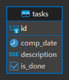
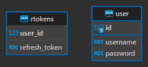

# Cat help server

## Небольшой restfull бэкенд для хранения и получения заметок и событий.

Написал для себя, чтобы можно было иметь постоянный доступ к истории лечения кота, необходимым процедурам и событиям.

## Возможности:
> * Сохранение описания события, его даты и статуса готовности (сделано/ не сделано)
> * Получение событий по дате (выдаются события на месяц) для отображения на каком-нибудь календаре на любом клиенте.
> * Изменение статуса выполнения задачи
> * Удаление задачи
> * Авторизация по json токену
> * Хранение данных на внешней бд (postgresql

Логи записываются в папку logs.  
Кодировка UTF-8.

## Тесты:
Имеются базовые тесты сервиса, в будущем планирую расширить их покрытие. Пока тестируется только работа с тасками.

## Эндпоинты:
### 1. [AuthApi.yml](openapi/CatHelpServerAuthApi.yml) - [Посмотреть красиво](https://petstore.swagger.io/?url=https://github.com/UrStanNightmare/cathelpserver/blob/dev/openapi/CatHelpServerAuthApi.yml)
### 2. [TaskApi.yml](openapi/CatHelpServerTaskApi.yml) - [Посмотреть красиво](https://petstore.swagger.io/?url=https://github.com/UrStanNightmare/cathelpserver/blob/dev/openapi/CatHelpServerTaskApi.yml)

## Запуск:
Имеется docker файл для сборки образа и запуска контейнера.  
Стоит указать переменные окружения:
> * SPRING_DATASOURCE_URL - путь к бд.
> * SPRING_DATASOURCE_USERNAME - пользователь бд
> * SPRING_DATASOURCE_PASSWORD - пароль пользователя

> * SPRING_SERVER_PORT - порт сервера. Стандартный - 8080
> * SPRING_SERVER_AVAILABLE_ORIGINS - перечисление origin-ов для которых будет разрешен доступ. Можно оставить пустым для того, чтобы можно было отправлять запросы с любого клиента(не рекомендуется)

> * SPRING_SECURITY_SECRET_ACCESS - секрет для создания и проверки токенов доступа, закодированный в base64
> * SPRING_SECURITY_SECRET_REFRESH - секрет для создания и проверки токенов обновления, закодированный в base64  
>   Например, YWRhc2Rhc2RhZGRkZGRkZGRkZGRkZGRkZGRkZGRkZGRkZGRkZGRkZGRkZGRkZGQ= 

> * SPRING_SECURITY_EXPIRATION_TIME_ACCESS - время жизни access токена в секундах
> * SPRING_SECURITY_EXPIRATION_TIME_REFRESH - время жизни refresh токена в секундах

Для работы необходима внешняя бд PostgreSql, путь указывается на неё. В бд необходимо наличие 3-х схем:
> * liquibase
> * cathelp
> * users

Таблицы будут созданы автоматически при помощи liquibase =>
[master.xml](src/main/resources/liquibase/master.xml)

### В cathelp будет находиться:

### В users будет находиться:

В дальнейшем user_id будет внешним ключом, пока для тестирования оставляю так.

## Пример docker-compose:
### скоро будет

## Авторизация:
> ### В текущей версии реализована авторизация по jwt. Добавлен фильтр, который будет проверять его наличие в заголовках запроса.
> ### Данная реализация не является безопасной т.к. токен отправляется напрямую в браузер, открывая несколько уязвимостей. В дальнейшем будет переход на протокол Oauth 2.0

В настоящий момент функция добавления новых пользователей сервисом не предусмотрена. Код есть, однако эндпоинт не добавлен.  
Это сделано в целях безопасности. Пользователя придётся добавлять в базу вручную.

## Добавление нового пользователя.
> ### 1. Придумать имя пользователя и пароль (password).
> ### 2. Отправиться на сайт https://bcrypt-generator.com/.
> ### 3. Поставить значение rounds на 10.
> ### 4. Ввести свой пароль в поле с кнопкой encrypt.
> ### 5. Скопировать свой зашифрованный пароль (e-password).
> ### 6. С помощью сторонних програм, например таких как pgAdmin или DBeaver, подключиться к внешней бд.
> ### 7. Зайти в схему *users*.
> ### 8. Открыть таблицу *user*.
> ### 9. Добавить новую запись, а именно - в поле *username* записать Ваше имя пользователя. В поле *password* вставить зашифрованный пароль (e-password). Затем отправить данные на сохранение.
> ### !!! НЕ ДОБАВЛЯЙТЕ ID ВРУЧНУЮ, СУБД САМА ИСПОЛЬЗУЕТ СЛУЖЕБНУЮ ПОСЛЕДОВАТЕЛЬНОСТЬ ЧИСЕЛ ДЛЯ ДОБАВЛЕНИЯ ID!!!
> ### 10. Вы великолепны! А ваш новый пользователь теперь имеет доступ к сервису.

## Клиенты:
### Так как данный сервис - всего лишь бэкенд, а Вам вряд-ли нравится работать с голыми json данными, необходимо выбрать удобный для себя клиент.
> ## В наличии:
> ### * Небольшой web клиент - [Cat-help-client](https://github.com/UrStanNightmare/cat-task-manager)
> ### * Мобильный клиент - в планах
> ### * Приватный навык для яндекс станции - скоро будет

## Планы:
* Переход на протокол OAuth2
* Добавление возможности загрузки файлов, таких как картинки и pdf
* Улучшение автотестов
